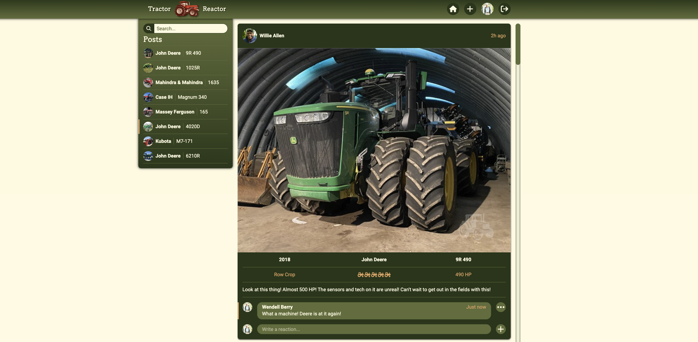

## [Tractor Reactor](https://tractor-reactor.netlify.app/)

The idea for *Tractor Reactor* was conceived as a solution to a prominent, modern-day problem--that farmers have no means of sharing their passion for tractors and tractor-related accessories with the world without fear of scrutiny. 

*Tractor Reactor* aims to provide a platform for farmers to share their tractors doing all the amazing things that tractors do.

But the real magic of Tractor Reactor is in its ability to keep you up to date with the latest and greatest in tractor trends. Need a new plow? Tractor Reactor's got you covered. Looking for some sweet tractor accessories? Tractor Reactor's on it. Want to stay on top of the hottest new tractor models? You guessed it, Tractor Reactor's your go-to source.

Join [*Tractor Reactor*](https://tractor-reactor.netlify.app/) today, and fuel your passion for tractors.

## [Tractor Reactor Back-End](https://github.com/robfrid06/tractor-reactor-back-end)

## Technologies Used

## Attributions

- Icons from [React Icons](https://react-icons.github.io/react-icons/)
- Loading spinners from [React Spinners](https://www.npmjs.com/package/react-spinners)
- Landing video by [Asgard Studios](https://www.youtube.com/@AsgardStudios)

## Icebox

- [ ] Allow users to view and follow other profiles
- [ ] Allow users to like posts
- [ ] Allow users to upload multiple photos to a post
- [ ] Allow users to filter posts by a certain criteria
- [ ] Add animations with React Framer